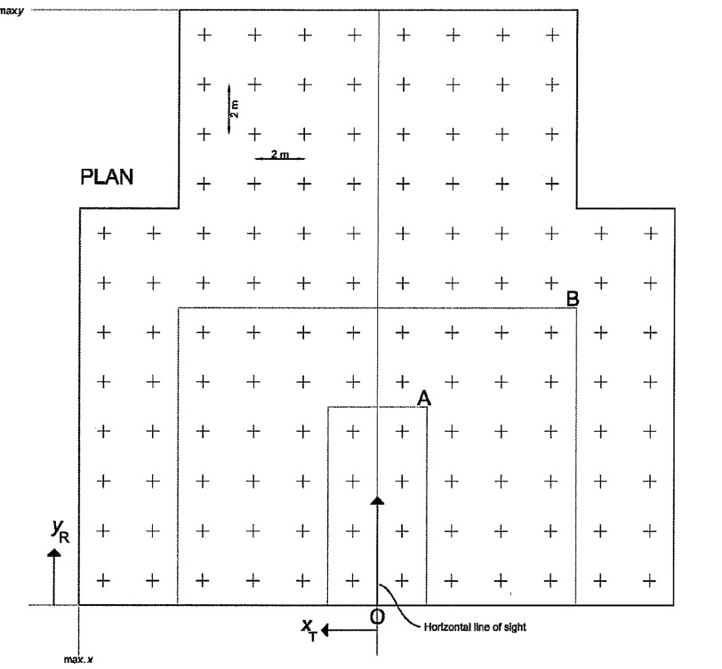

```{r setup, include=FALSE}
rm(list=ls(all = TRUE)) # Remove all objects
cat("\014") # clearing console history

knitr::opts_chunk$set(echo = TRUE)

library(tidyverse)
library(openxlsx)
library(knitr)

```

# Introduction

From CIE-190 2010 Standard.

box form, cycle form and cylindrical form need to be checked.

UGR basic equation

$$ R_\text{UG} = 8 \log \left[ \frac{0.25}{L_\text{b}}\sum \frac{L^2\omega}{p^2} \right]$$
Using standard luminaire arrangements (e.g. 2H x 4H), this formula can be simplified to (see CIE-190 2010)

$$R_\text{UG} = 8 \log \left[ \sum \frac{K I_{C\gamma}^2}{A} \right] - 8 \log E_\text{WID}$$

# CIE 190:2010 tables

## Luminous intensity table in cd/klm

```{r}
df_I <- readWorkbook(
	"CIE-190-2010_tables.xlsx", 
	sheet = "Table 7",
	startRow = 2
	)
```

## Pre-calculated parameters for luminaires in the standard array

```{r}
t2 <- readWorkbook("CIE-190-2010_tables.xlsx", sheet = "Table 2", startRow = 1)
kable(t2)
```

## Data for calculation of indirect illuminance on walls for luminaires in the standard array

```{r}
t3 <- readWorkbook("CIE-190-2010_tables.xlsx", sheet = "Table 3", startRow = 1)
kable(t3)
```

## Geometric factor values for luminaires in the standard array

```{r}
t4 <- readWorkbook("CIE-190-2010_tables.xlsx", sheet = "Table 4", startRow = 1)
kable(t4)
```

## Transfer factor values

```{r}
t5 <- readWorkbook(
	"CIE-190-2010_tables.xlsx",
	sheet = "Table 5_long",
	startRow = 1
	)
kable(t5)
```

# Working Example

## Luminaire data and pre-definitions
```{r}
X <- "2H"
Y <- "4H"
reflectance <- "70/50/20"
# luminous areas in m²
A_B <- 0.316 
A_S <- 0
A_E <- 0

flux_0 <- 1000
```

The standard array area are defined by the X and Y Dimension (2H x 4H) including the position of the luminaires (see following figure). Area A: 2H x 4H, Area B: 8H x 6H

```{r echo=FALSE}

```

## Calculation of $E_\text{WID}$ Value

1. Calculate the average intensity from luminous intensity table fro every 10° $\gamma$ angle
2. Multiply with pre-defined zone factor to get Zonal Flux (ExF)


```{r}
zone_factor = c(0.095, 0.283, 0.463, 0.628, 0.774, 0.897, 0.993, 1.058, 1.091)
df_90 <- df_I %>% 
	filter(gamma %in% seq(5, 85, 10)) %>% 
	mutate(
		AverageIntensity = rowMeans(across(C0:C345)),
		ZoneFactor = zone_factor,
		ZonalFlux = round(AverageIntensity * ZoneFactor, 2),
		# Wrong average intensities check CIE standard
		ZonalFlux = c(25.10,  72.55, 106.69, 120.47, 116.03,
									95.71,  66.66,  37.58, 11.95)
		)
flux_total_90 <- sum(df_90$ZonalFlux)
df_180 <- df_I %>% 
	filter(gamma %in% seq(95, 175, 10)) %>% 
	mutate(
		AverageIntensity = rowMeans(across(C0:C345)),
		ZoneFactor = rev(zone_factor),
		ZonalFlux = (AverageIntensity * ZoneFactor) %>% round(2)
		)
flux_total <- flux_total_90 + sum(df_180$ZonalFlux)
```

$$R_\text{LO} = \frac{\text{Total flux in arbitrary units (M)}}{\text{Total bare lamp flux in arbitrary units}}$$
$$F_\text{S} = \frac{R_\text{LO} \cdot 1000}{\text{Total flux in arbitrary units (M)}}$$
$$R_\text{DLO} = \frac{\text{Total flux 0° to 90° in arbitrary units (L)} \cdot F_\text{S}}{1000}$$
$$R_\text{ULO} = R_\text{LO} - R_\text{DLO}$$

```{r}
R_LO  <- (flux_total_90 / flux_0) %>% round(2)
F_S   <- (R_LO * 1000 / flux_total) %>% round(3)
R_DLO <- (flux_total_90 * F_S / 1000) %>% round(2)
R_ULO <- R_LO - R_DLO
```

3. Calculating the cumulative CIE zonal flux using scale factor $F_\text{S}$

```{r}
df_90 <- df_90 %>% 
	mutate(
		ZonalFlux_FxSF = (ZonalFlux * F_S) %>% round(2),
		# rounding problems in CIE standard
		ZonalFlux_FxSF = c(25.00, 72.26, 106.26, 119.98, 115.57,
											 95.32, 66.39,  37.43, 11.91)
		)

zonal_flux_0_40 <- df_90 %>% 
	filter(0 < gamma & gamma < 40) %>% 
	summarise(across(ZonalFlux_FxSF, sum)) %>% 
	pull()
zonal_flux_0_60 <- df_90 %>% 
	filter(0 < gamma & gamma < 60) %>% 
	summarise(across(ZonalFlux_FxSF, sum)) %>% 
	pull()
zonal_flux_0_70 <- df_90 %>% 
	filter(0 < gamma & gamma < 70) %>% 
	summarise(across(ZonalFlux_FxSF, sum)) %>% 
	pull()
zonal_flux_0_90 <- df_90 %>% 
	filter(0 < gamma & gamma < 90) %>% 
	summarise(across(ZonalFlux_FxSF, sum)) %>% 
	pull()
zonal_flux_40_50 <- df_90 %>% 
	filter(40 < gamma & gamma < 50) %>% 
	summarise(across(ZonalFlux_FxSF, sum)) %>% 
	pull()
zonal_flux_70_80 <- df_90 %>% 
	filter(70 < gamma & gamma < 80) %>% 
	summarise(across(ZonalFlux_FxSF, sum)) %>% 
	pull()

flux_zL1 <- (zonal_flux_0_40 + 0.130 * zonal_flux_40_50) %>% round(2)
flux_zL2 <-  zonal_flux_0_60 %>% round(2)
flux_zL3 <- (zonal_flux_0_70 + 0.547 * zonal_flux_70_80) %>% round(2)
flux_zL4 <-  zonal_flux_0_90 %>% round(2)
```

4. Calculate the distributions factors using X and Y dimensions

```{r}
F_GL <- filter(t4, X_Dim == X & Y_Dim == Y)

F_GL1 <- F_GL$F_GL1
F_GL2 <- F_GL$F_GL2
F_GL3 <- F_GL$F_GL3
F_GL4 <- F_GL$F_GL4

flux_zL <- (flux_zL1 * F_GL1 + flux_zL2 * F_GL2 + 
						flux_zL3 * F_GL3 + flux_zL4 * F_GL4) %>% round(2)

F_DF <- (flux_zL / flux_0) %>% round(2)
F_DW <- R_DLO - F_DF
F_DC <- R_ULO
```

5. Calculate the indirect utilisation factor for walls using reflectance, transfer factor values, X and Y dimensions

```{r}
F_T <- filter(t5, `Reflectance_C/W/R` == reflectance & X_Dim == X & Y_Dim == Y)

`F_T,FW` <- F_T$`F_T,FW`
`F_T,WW-1` <- F_T$`F_T,WW-1`
`F_T,CW` <- F_T$`F_T,CW`

F_UWID <- (F_DF * `F_T,FW` + F_DW * `F_T,WW-1` + F_DC * `F_T,CW`) %>% round(4)
```

6. Calculate $E_\text{WID}$

```{r}
B <- filter(t3, X_Dim == X & Y_Dim == Y) %>% pull(B)

E_WID <- (F_UWID * B) %>% round(2)
```

## Calculation of uncorrected UGR Value

1. Linear interpolation of luminous intensity based on light distribution
2. Calculate projected areas for luminaires viewed crosswise and endwise

```{r}
gamma_x <- df_I$gamma
df <- select(df_I, -(gamma)) %>% 
	mutate(C360 = C0)
C_x <- colnames(df) %>% sub("C", "", .) %>% as.numeric()
I_x <- data.matrix(df) %>% t()

# for linear intepolating the luminous intensity data
y_R_H <- stringr::str_sub(Y, 1, nchar(Y) - 1) %>% as.numeric() - 0.5
x_T_H <- stringr::str_sub(X, 1, nchar(X) - 1) %>% as.numeric() / 2 - 0.5

df_sub <- filter(t2, `x_T/H` <= x_T_H)

df_cross <- df_end <- data.frame()

for (i_x in unique(df_sub$`x_T/H`)) {
	df_sub2 <- df_sub %>% 
		filter(`x_T/H` == i_x & `y_R/H` <= y_R_H) %>% 
		drop_na()
	df_cross <- df_sub2 %>% 
		mutate(C = 360 - C) %>%
		bind_rows(df_sub2, .) %>% 
		mutate(
			I_Cgamma = pracma::interp2(gamma_x, C_x, I_x, gamma, C),
			#I_Cgamma = c(83.03, 47.12, 29.70, 83.03, 47.12, 29.70), # correction
			A = (A_B * `H/D` + A_S * `y_R/D` + A_E * `x_T/D`) %>% round(3)
			) %>% 
		bind_rows(df_cross, .)
	
	df_sub3 <- df_sub2 %>% mutate(C = 90 + C)
	df_end <- df_sub2 %>% 
		mutate(C = 90 - C) %>%
		bind_rows(df_sub3, .) %>% 
		mutate(
			I_Cgamma = pracma::interp2(gamma_x, C_x, I_x, gamma, C),
			#I_Cgamma = c(106.55, 65.57, 46.22, 106.55, 65.57, 46.22), # correction
			A = (A_B * `H/D` + A_S * `x_T/D` + A_E * `y_R/D`) %>% round(3)
			) %>% 
		bind_rows(df_end, .)
}
```

3. Calculate uncorrected UGR viewed crosswise

```{r}
K <- df_cross$K
I_Cgamma <- df_cross$I_Cgamma
A <- df_cross$A

UGR_cross <- (8 * log10(sum(K * I_Cgamma^2 / A)) - 8 * log10(E_WID)) %>% 
	round(1)
print(UGR_cross)
```

4. Calculate uncorrected UGR viewed endwise

```{r}
K <- df_end$K
I_Cgamma <- df_end$I_Cgamma
A <- df_end$A

UGR_end <- (8 * log10(sum(K * I_Cgamma^2 / A)) - 8 * log10(E_WID)) %>% 
	round(1)
print(UGR_end)
```

## Calculation of corrected UGR Value

$$R_\text{UG}(\phi) = R_\text{UG}(\phi_0) + 8 \log \left( \frac{\phi}{\phi_0} \right)$$

# Calculation of UGR table

```{r}
UGR_table <- t5 %>% 
	select(`Reflectance_C/W/R`:Y_Dim) %>% 
	mutate(UGR_cross = NA, UGR_end = NA)

for (i in seq(nrow(UGR_table))) {
	# pre-definitions
	X <- UGR_table$X_Dim[i]
	Y <- UGR_table$Y_Dim[i]
	reflectance <- UGR_table$`Reflectance_C/W/R`[i]

	# cumulative CIE zonal flux
	df_90 <- df_90 %>% 
	mutate(ZonalFlux_FxSF = (ZonalFlux * F_S) %>% round(2))

	zonal_flux_0_40 <- df_90 %>% 
		filter(0 < gamma & gamma < 40) %>% 
		summarise(across(ZonalFlux_FxSF, sum)) %>% 
		pull()
	zonal_flux_0_60 <- df_90 %>% 
		filter(0 < gamma & gamma < 60) %>% 
		summarise(across(ZonalFlux_FxSF, sum)) %>% 
		pull()
	zonal_flux_0_70 <- df_90 %>% 
		filter(0 < gamma & gamma < 70) %>% 
		summarise(across(ZonalFlux_FxSF, sum)) %>% 
		pull()
	zonal_flux_0_90 <- df_90 %>% 
		filter(0 < gamma & gamma < 90) %>% 
		summarise(across(ZonalFlux_FxSF, sum)) %>% 
		pull()
	zonal_flux_40_50 <- df_90 %>% 
		filter(40 < gamma & gamma < 50) %>% 
		summarise(across(ZonalFlux_FxSF, sum)) %>% 
		pull()
	zonal_flux_70_80 <- df_90 %>% 
		filter(70 < gamma & gamma < 80) %>% 
		summarise(across(ZonalFlux_FxSF, sum)) %>% 
		pull()
	
	# distributions factors
	flux_zL1 <- (zonal_flux_0_40 + 0.130 * zonal_flux_40_50) %>% round(2)
	flux_zL2 <-  zonal_flux_0_60 %>% round(2)
	flux_zL3 <- (zonal_flux_0_70 + 0.547 * zonal_flux_70_80) %>% round(2)
	flux_zL4 <-  zonal_flux_0_90 %>% round(2)
	
	F_GL <- filter(t4, X_Dim == X & Y_Dim == Y)

	F_GL1 <- F_GL$F_GL1
	F_GL2 <- F_GL$F_GL2
	F_GL3 <- F_GL$F_GL3
	F_GL4 <- F_GL$F_GL4
	
	flux_zL <- (flux_zL1 * F_GL1 + flux_zL2 * F_GL2 + 
							flux_zL3 * F_GL3 + flux_zL4 * F_GL4) %>% round(2)
	
	F_DF <- (flux_zL / flux_0) %>% round(2)
	F_DW <- R_DLO - F_DF
	F_DC <- R_ULO
	
	# indirect utilisation factor for walls
	F_T <- t5 %>% 
		filter(`Reflectance_C/W/R` == reflectance & X_Dim == X & Y_Dim == Y)

	`F_T,FW` <- F_T$`F_T,FW`
	`F_T,WW-1` <- F_T$`F_T,WW-1`
	`F_T,CW` <- F_T$`F_T,CW`
	
	F_UWID <- (F_DF * `F_T,FW` + F_DW * `F_T,WW-1` + F_DC * `F_T,CW`) %>% round(4)
		
	# E_WID
	B <- filter(t3, X_Dim == X & Y_Dim == Y) %>% pull(B)
	E_WID <- (F_UWID * B) %>% round(2)
	
	# calculate UGR values
	gamma_x <- df_I$gamma
	df <- select(df_I, -(gamma)) %>% 
		mutate(C360 = C0)
	C_x <- colnames(df) %>% sub("C", "", .) %>% as.numeric()
	I_x <- data.matrix(df) %>% t()
	
	# for linear intepolating the luminous intensity data
	y_R_H <- stringr::str_sub(Y, 1, nchar(Y) - 1) %>% as.numeric() - 0.5
	x_T_H <- stringr::str_sub(X, 1, nchar(X) - 1) %>% as.numeric() / 2 - 0.5
	
	df_sub <- filter(t2, `x_T/H` <= x_T_H)
	
	df_cross <- df_end <- data.frame()
	
	for (i_x in unique(df_sub$`x_T/H`)) {
		df_sub2 <- df_sub %>% 
			filter(`x_T/H` == i_x & `y_R/H` <= y_R_H) %>% 
			drop_na()
		df_cross <- df_sub2 %>% 
			mutate(C = 360 - C) %>%
			bind_rows(df_sub2, .) %>% 
			mutate(
				I_Cgamma = pracma::interp2(gamma_x, C_x, I_x, gamma, C),
				A = (A_B * `H/D` + A_S * `y_R/D` + A_E * `x_T/D`) %>% round(3)
				) %>% 
			bind_rows(df_cross, .)
		
		df_sub3 <- df_sub2 %>% mutate(C = 90 + C)
		df_end <- df_sub2 %>% 
			mutate(C = 90 - C) %>%
			bind_rows(df_sub3, .) %>% 
			mutate(
				I_Cgamma = pracma::interp2(gamma_x, C_x, I_x, gamma, C),
				A = (A_B * `H/D` + A_S * `x_T/D` + A_E * `y_R/D`) %>% round(3)
				) %>% 
			bind_rows(df_end, .)
	}
	
	# UGR viewed crosswise
	K <- df_cross$K
	I_Cgamma <- df_cross$I_Cgamma
	A <- df_cross$A
	
	UGR_cross <- (8 * log10(sum(K * I_Cgamma^2 / A)) - 8 * log10(E_WID)) %>% 
		round(1)
	UGR_table$UGR_cross[i] <- UGR_cross
	
	# UGR viewed endwise
	K <- df_end$K
	I_Cgamma <- df_end$I_Cgamma
	A <- df_end$A
	
	UGR_end <- (8 * log10(sum(K * I_Cgamma^2 / A)) - 8 * log10(E_WID)) %>% 
		round(1)
	UGR_table$UGR_end[i] <- UGR_end
}


```

## printing UGR table

```{r}
library(kableExtra)

dt <- UGR_table %>% 
	pivot_wider(names_from = `Reflectance_C/W/R`, values_from = c(UGR_cross, UGR_end))

reflectance_names <- unique(UGR_table$`Reflectance_C/W/R`)

kbl(
	dt, 
	align = c("r"),
	col.names = c("X", "Y", reflectance_names, reflectance_names)
	) %>% 
	kable_classic_2() %>% 
	add_header_above(c(
		"Room Dimensions" = 2, 
		"Reflectances (Ceiling/Wall/Reference plane)" = 5, 
		"Reflectances (Ceiling/Wall/Reference plane)" = 5
		)) %>% 
	add_header_above(c(
		" " = 2, 
		"Viewed crosswise" = 5,
		"Viewed endwise" = 5
		)) %>% 
	row_spec(c(6, 12, 16), extra_css = "border-bottom: 1px solid") 
```

